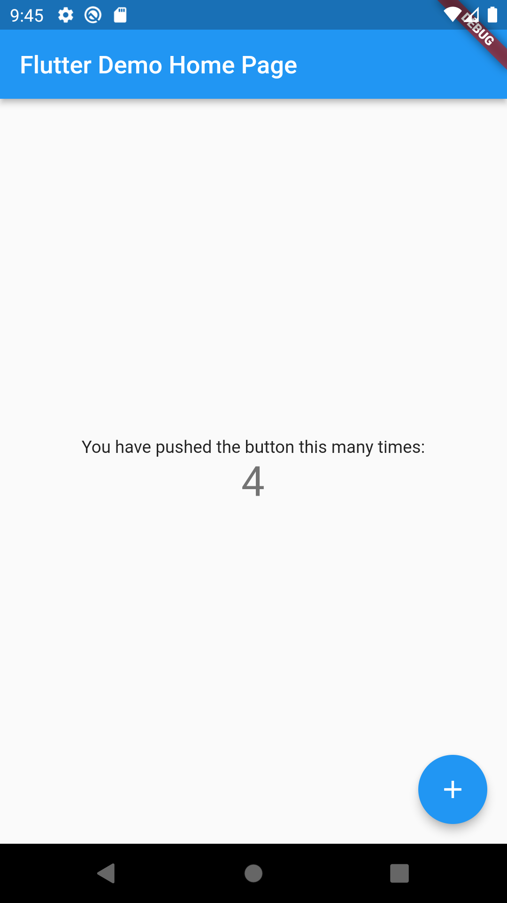
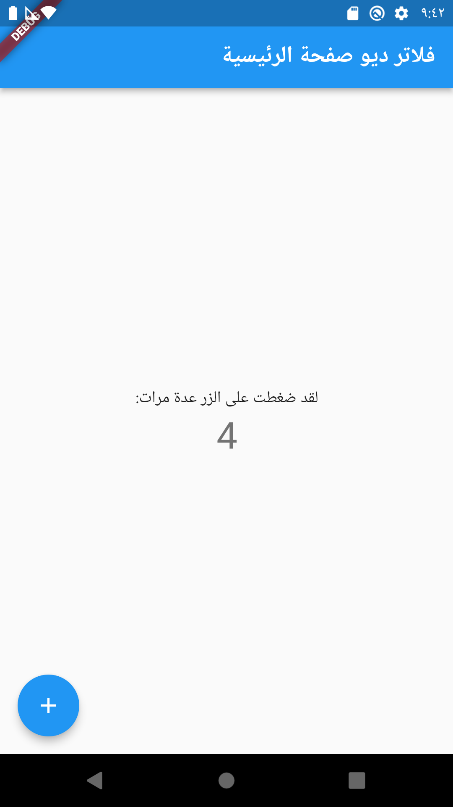

# Flutter localization

Flutter multi language without use package.

## Android Screenshots Localizations


  English language                 |   Arabic language      
:---------------------------------:|:-------------------------:
|

# steps
1. create file as **assets**

## Directory assets
```
assets
└── lang
    ├── en.json
    └── ar.json
```
- [ ] set key and value
- [x] en.json
```json
{
    "title_Home": "Flutter Demo Home Page",
    "counter": "You have pushed the button this many times:",
    "tooltip_Increment": "Increment"
}
```
- [x] ar.json

```json
{
    "title_Home": "فلاتر ديو صفحة الرئيسية",
    "counter": "لقد ضغطت على الزر عدة مرات:",
    "tooltip_Increment": "زيادة"
}
```

2. Go to **pubspec.yaml** file.
  - add flutter_localizations as dependencies.
 ```pubspec.yaml
dependencies:
  flutter:
    sdk: flutter
  flutter_localizations:
    sdk: flutter
```
  - import file **assets** lang
 ```pubspec.yaml
  assets:
    - assets/lang/
```
3. create AppLocalizations and AppLocalizationsDelegate classes.

### AppLocalizations
```dart
class AppLocalizations {
  late Locale locale;
  late Map<String, String> _valueText;
  AppLocalizations(this.locale);

  static AppLocalizations of(BuildContext context) {
    return Localizations.of(context, AppLocalizations);
  }

  static const LocalizationsDelegate<AppLocalizations> delegate =
      AppLocalizationsDelegate();

  Future loadTranslateFile() async {
    String _langFile =
        await rootBundle.loadString('assets/lang/${locale.languageCode}.json');

    Map<String, dynamic> _json = jsonDecode(_langFile);
    _valueText = _json.map((key, value) => MapEntry(key, value.toString()));
  }

  String getTranslate(String key) {
    return _valueText[key]!;
  }
}


```
### AppLocalizationsDelegate
```dart
class AppLocalizationsDelegate extends LocalizationsDelegate<AppLocalizations> {
  const AppLocalizationsDelegate();
  @override
  bool isSupported(Locale locale) {
    return ['en', 'ar'].contains(locale.languageCode);
  }

  @override
  Future<AppLocalizations> load(Locale locale) async {
    AppLocalizations appLocalizations = AppLocalizations(locale);
    await appLocalizations.loadTranslateFile();
    return appLocalizations;
  }

  @override
  bool shouldReload(covariant AppLocalizationsDelegate old) => false;
}

```
4. injection appLocalizations delegate in root widget.  
```dart
MaterialApp(
      title: 'Flutter Demo',
      theme: ThemeData(
        primarySwatch: Colors.blue,
      ),
      localizationsDelegates: const [
        AppLocalizations.delegate,
        GlobalMaterialLocalizations.delegate,
        GlobalWidgetsLocalizations.delegate,
      ],
      supportedLocales: const [
        Locale('en', ''),
        Locale('ar', ''),
      ],
// check Locale supported
      localeResolutionCallback:
          (Locale? deviceLocale, Iterable<Locale> supportedLocales) =>
              deviceLocale != null &&
                      ['en', 'ar'].contains(deviceLocale.languageCode)
                  ? deviceLocale
                  : supportedLocales.first,
      home: const MyHomePage(),
    );
```

5. use **AppLocalizations** to get text. 
```dart
AppLocalizations.of(context).getTranslate(keyJsonFile);
AppLocalizations.of(context).getTranslate('tooltip_Increment');
```

# The end
Thank's to read ,hope help you.


